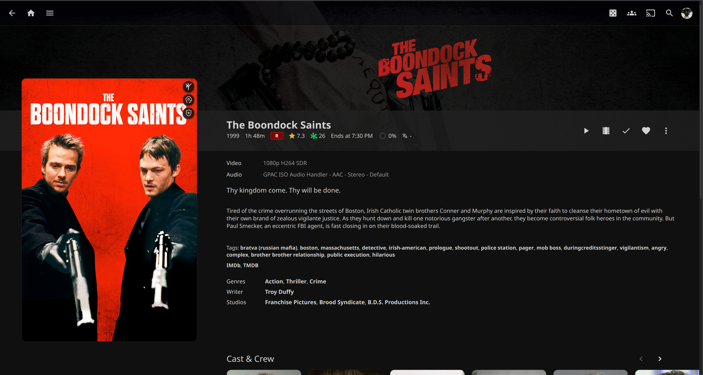
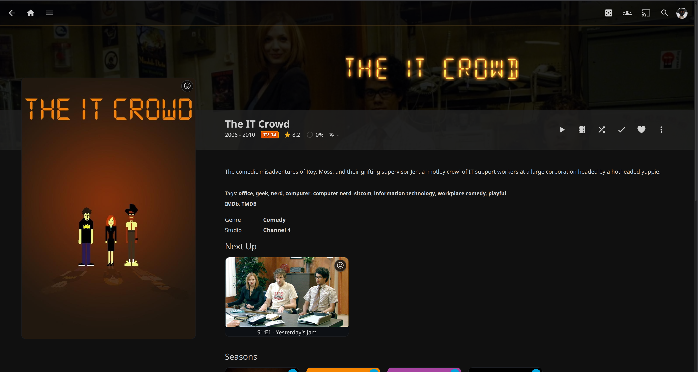

# Jellyfin Professional CSS

A clean and modern custom CSS theme for Jellyfin. This theme focuses on premium aesthetics, glassmorphism, and smooth transitions to elevate your media server's user interface.

## Features

- **Modern Glassmorphism**: High-quality blur effects with subtle borders and glows.
- **Dynamic Backgrounds**: Custom-tailored backgrounds for the dashboard, movies, TV shows, and collections.
- **Premium Buttons & Cards**: Enhanced interactive elements with smooth scale and elevation effects.
- **Clean Navigation**: Simplified and professional-looking headers and drawer menus.
- **Responsive Scrollbars**: Custom, minimal scrollbars that blend into the theme.

## Screenshots

| Login Page | Home Screen |
| :---: | :---: |
|  |  |

| Movies Page | Movie Details |
| :---: | :---: |
|  |  |

| TV Shows Page | TV Show Details |
| :---: | :---: |
|  |  |

## Installation

1. Log in to your Jellyfin server.
2. Navigate to **Dashboard > Branding**.
3. Scroll down to the **Custom CSS code** section.
4. Copy and paste the contents of `jellyfin.css` into the field.
5. Click **Save**.

## Customization

The CSS uses placeholders for background and brand images. To customize the theme with your own assets, search for the following URLs in `jellyfin.css` and replace them with your own links:

- `https://example.com/your-login-cover.jpg` (Login Page Background)
- `https://example.com/your-home-cover.jpg` (Dashboard Background)
- `https://example.com/your-movie-cover.jpg` (Movie Page Background)
- `https://example.com/your-tv-cover.jpg` (TV Page Background)
- `https://example.com/your-collections-cover.jpg` (Collections Background)
- `https://example.com/your-logo.png` (Site Logo)

## Contributing

Contributions are welcome! If you have suggestions for new features, bug fixes, or design improvements, feel free to open an issue or submit a pull request.

---

**Developed by [Brad Myrick](https://github.com/BradMyrick)**  
*Repository: [LocalNest.tv](https://github.com/LocalNest/LocalNest.tv)*
